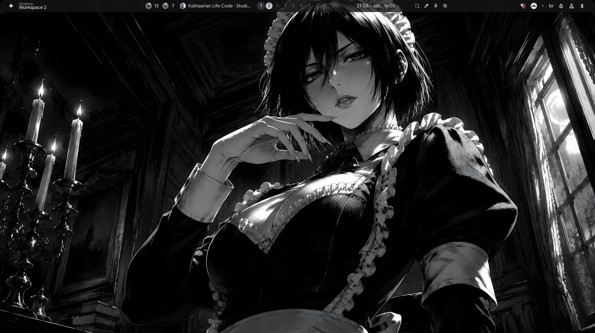

# Dotfiles

<p align="center">
  
</p>

# 🛠️ Stack

- Hyprland  
  https://github.com/hyprwm/Hyprland

- Quickshell  
  https://github.com/quickshell-mirror/quickshell

- end-4/dots-hyprland  
  https://github.com/end-4/dots-hyprland

---

# 🚀 Install

Replace the files inside:

```bash
~/.config
```
